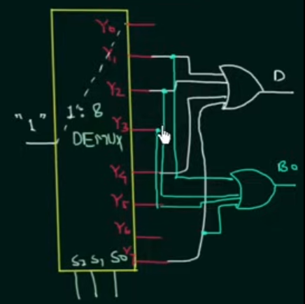
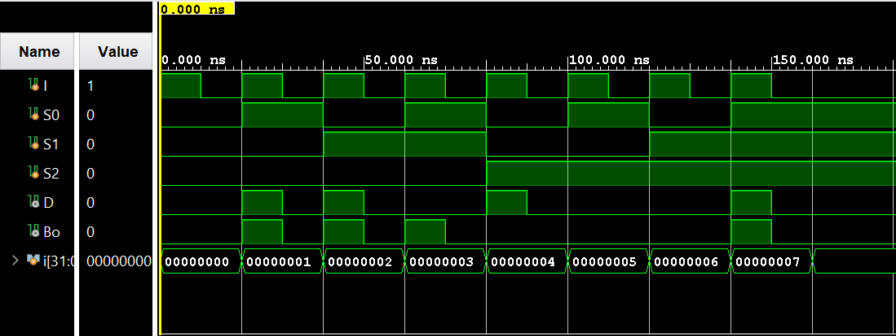

# Full Subtractor using 1:8 Demultiplexer

This project implements a **full subtractor** using a **1:8 demultiplexer (DEMUX)** approach, designed to be simulated in **Xilinx Vivado**.

- **RTL:** `fullSub.v` and `eightOneDeMultiplexer.v`
- **Testbench:** `fullSub_tb.v`
- **Assets:** `imageAssets/FullSubDemuxCircuit.png`, `imageAssets/FullSubDemuxWaveform.png`

## Table of Contents

- [What the Circuit Does](#what-the-circuit-does)
- [Full Subtractor Truth Table](#full-subtractor-truth-table)
- [SOP (Sum-Of-Products) Equations](#sop-sum-of-products-equations)
- [1:8 Demultiplexer Basics (With Enable)](#18-demultiplexer-basics-with-enable)
- [DEMUX → Full Subtractor Mapping](#demux-full-subtractor-mapping)
- [Circuit Description](#circuit-description)
- [RTL Modules](#rtl-modules)
- [Testbench Output](#testbench-output)
- [Running the Project in Vivado](#running-the-project-in-vivado)
- [Project Files](#project-files)

## What the Circuit Does

A **full subtractor** computes:

- `D`  = the **difference** (least-significant bit of `A − B − Bi`)
- `Bo` = the **borrow-out**

Using inputs:

- `A`  (mapped to `S2`)
- `B`  (mapped to `S1`)
- `Bi` (mapped to `S0`)

This design uses a **1:8 demultiplexer** to generate the relevant **minterms** of the full subtractor logic, then combines them with **OR** gates.

Note on the project input `I`:

- All DEMUX outputs are proportional to `I`.
- In `fullSub.v`, `I` is exposed so you can force the entire DEMUX-based logic on/off in simulation.
- For normal subtractor operation, set `I = 1'b1`. If `I = 1'b0`, then `D = 0` and `Bo = 0`.

## Full Subtractor Truth Table

The full subtractor truth table (with `D` and `Bo` computed for `A − B − Bi`) is:

| A | B | Bi | D | Bo |
|---|---|----|---|----|
| 0 | 0 | 0  | 0 | 0  |
| 0 | 0 | 1  | 1 | 1  |
| 0 | 1 | 0  | 1 | 1  |
| 0 | 1 | 1  | 0 | 1  |
| 1 | 0 | 0  | 1 | 0  |
| 1 | 0 | 1  | 0 | 0  |
| 1 | 1 | 0  | 0 | 0  |
| 1 | 1 | 1  | 1 | 1  |

## SOP (Sum-Of-Products) Equations

Using the minterm index formed as:

`m = (A B Bi)` interpreted as a 3-bit binary number (so `m = 4·A + 2·B + Bi`)

the standard SOP form used by this project is:

- `D(A,B,Bi) = Σm(1, 2, 4, 7)`
- `Bo(A,B,Bi) = Σm(1, 2, 3, 7)`

Expanded SOP (with complements written using Unicode overline):

- `D = A̅B̅Bi ∨ A̅BBi̅ ∨ AB̅Bi̅ ∨ AB Bi`
- `Bo = A̅B̅Bi ∨ A̅BBi̅ ∨ A̅BBi ∨ AB Bi`

<a id="18-demultiplexer-basics-with-enable"></a>
## 1:8 Demultiplexer Basics (With Enable)

A **1:8 demultiplexer** routes a single input `I` to exactly one of eight outputs based on three select lines.

Signals in `eightOneDeMultiplexer.v`:

- `E`  : enable
- `S2, S1, S0` : select bits
- `I`  : DEMUX data input
- `Y0 ... Y7` : DEMUX outputs

Behavior:

- If `E = 0`, then `Y0...Y7 = 0`.
- If `E = 1`, then the select value `(S2 S1 S0)` determines which `Yk` equals `I`, and all other outputs are `0`.

In this project, `E` is tied high (`1'b1`) inside `fullSub.v`, so the demultiplexer is always enabled.

### DEMUX Output Equations

Each output is:

`Yk = E ∧ I ∧ (the corresponding minterm condition on S2,S1,S0)`

With complements shown as overlined variables:

- `Y0 = E ∧ I ∧ S2̅ ∧ S1̅ ∧ S0̅`
- `Y1 = E ∧ I ∧ S2̅ ∧ S1̅ ∧ S0`
- `Y2 = E ∧ I ∧ S2̅ ∧ S1 ∧ S0̅`
- `Y3 = E ∧ I ∧ S2̅ ∧ S1 ∧ S0`
- `Y4 = E ∧ I ∧ S2 ∧ S1̅ ∧ S0̅`
- `Y5 = E ∧ I ∧ S2 ∧ S1̅ ∧ S0`
- `Y6 = E ∧ I ∧ S2 ∧ S1 ∧ S0̅`
- `Y7 = E ∧ I ∧ S2 ∧ S1 ∧ S0`

<a id="demux-full-subtractor-mapping"></a>
## DEMUX → Full Subtractor Mapping

This project maps the full subtractor inputs into the DEMUX select lines:

- `S2 = A`
- `S1 = B`
- `S0 = Bi`

Then the demultiplexer generates all minterms `Y0...Y7`, and the subtractor outputs are formed by OR-ing the appropriate DEMUX outputs:

#### DEMUX select mapping (when `E = 1` and `I = 1`)

| S2 | S1 | S0 | Active output |
|---|---|---|---|
| 0 | 0 | 0 | `Y0` |
| 0 | 0 | 1 | `Y1` |
| 0 | 1 | 0 | `Y2` |
| 0 | 1 | 1 | `Y3` |
| 1 | 0 | 0 | `Y4` |
| 1 | 0 | 1 | `Y5` |
| 1 | 1 | 0 | `Y6` |
| 1 | 1 | 1 | `Y7` |

#### Minterm selection for `D` and `Bo`

| Output | Formed as |
|---|---|
| `D`  | `Y1 ∨ Y2 ∨ Y4 ∨ Y7` |
| `Bo` | `Y1 ∨ Y2 ∨ Y3 ∨ Y7` |

- `D = Y1 ∨ Y2 ∨ Y4 ∨ Y7`
- `Bo = Y1 ∨ Y2 ∨ Y3 ∨ Y7`

Because each `Yk` already includes `E` and `I`, both outputs scale with the DEMUX input:

- If `I = 0`, then `D = 0` and `Bo = 0`
- If `I = 1` and `E = 1`, then `D` and `Bo` follow the full subtractor truth table

## Circuit Description

Conceptually:

1. The `eightOneDeMultiplexer` produces `Y0...Y7`, where each `Yk` corresponds to one minterm of `(A, B, Bi)`.
2. The `fullSub` module connects `E = 1'b1` and ORs specific `Yk` lines to form:
   - `D` using `Y1, Y2, Y4, Y7`
   - `Bo` using `Y1, Y2, Y3, Y7`



## RTL Modules

### `eightOneDeMultiplexer.v`

Implements a combinational 1:8 demultiplexer with enable.

Ports:

- `E, S2, S1, S0, I`
- outputs `Y0 ... Y7`

All assignments are pure Boolean expressions:

- each `Yk` is `E ∧ I` ANDed with the matching select minterm

### `fullSub.v`

Implements the full subtractor using the demultiplexer outputs.

Ports:

- inputs: `I, S0, S1, S2`
- outputs: `D, Bo`

Key connections:

- instantiates DEMUX with enable `E = 1'b1`
- uses:
  - `D = Y1 ∨ Y2 ∨ Y4 ∨ Y7`
  - `Bo = Y1 ∨ Y2 ∨ Y3 ∨ Y7`

## Testbench Output

The testbench `fullSub_tb.v` sweeps all `S2,S1,S0` combinations (`0...7`) and toggles `I` between `1` and `0`.

Expected console-style output (from `$display` in the testbench):

```text
I = 1, S2 = 0, S1 = 0, S0 = 0, D = 0, Bo = 0
I = 0, S2 = 0, S1 = 0, S0 = 0, D = 0, Bo = 0
I = 1, S2 = 0, S1 = 0, S0 = 1, D = 1, Bo = 1
I = 0, S2 = 0, S1 = 0, S0 = 1, D = 0, Bo = 0
I = 1, S2 = 0, S1 = 1, S0 = 0, D = 1, Bo = 1
I = 0, S2 = 0, S1 = 1, S0 = 0, D = 0, Bo = 0
I = 1, S2 = 0, S1 = 1, S0 = 1, D = 0, Bo = 1
I = 0, S2 = 0, S1 = 1, S0 = 1, D = 0, Bo = 0
I = 1, S2 = 1, S1 = 0, S0 = 0, D = 1, Bo = 0
I = 0, S2 = 1, S1 = 0, S0 = 0, D = 0, Bo = 0
I = 1, S2 = 1, S1 = 0, S0 = 1, D = 0, Bo = 0
I = 0, S2 = 1, S1 = 0, S0 = 1, D = 0, Bo = 0
I = 1, S2 = 1, S1 = 1, S0 = 0, D = 0, Bo = 0
I = 0, S2 = 1, S1 = 1, S0 = 0, D = 0, Bo = 0
I = 1, S2 = 1, S1 = 1, S0 = 1, D = 1, Bo = 1
I = 0, S2 = 1, S1 = 1, S0 = 1, D = 0, Bo = 0
```

## Running the Project in Vivado

1. Open **Xilinx Vivado**.
2. Create a new **RTL Project**.
3. Add design sources:
   - `eightOneDeMultiplexer.v`
   - `fullSub.v`
4. Add simulation sources:
   - `fullSub_tb.v`
5. Set `fullSub_tb` as the **simulation top module**.
6. Run: **Flow → Run Simulation → Run Behavioral Simulation**.
7. Inspect waveforms for:
   - inputs: `I, S2, S1, S0`
   - outputs: `D, Bo`

Waveform reference:



## Project Files

| File | Description |
|---|---|
| `eightOneDeMultiplexer.v` | RTL 1:8 demultiplexer with enable |
| `fullSub.v` | Full subtractor built from demux outputs (OR of minterms) |
| `fullSub_tb.v` | Testbench that sweeps all `S2,S1,S0` combinations and toggles `I` |

**Author:** **Kadhir Ponnambalam**
